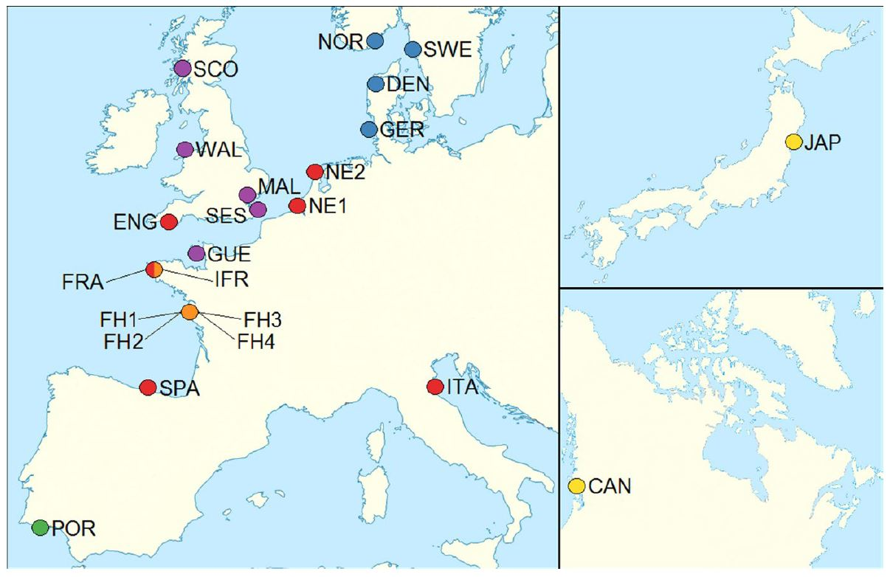

# 25334 Genomic methods in breeding and management of aquatic living resources. 
## Lecture 07: Introduction to Population Genetics & tools for conservation and management
### Teachers: Romina Henriques & Belen Jimenez-Mena
#### Date: Wednesday 21/10/2020

## Schedule of the lecture:

The lecture will consist on the following two parts, each with a theoretical and a practical part:
- 8am - 10pm: Introduction to population genetics (theory + practical). Slides can be found [here](Slides_part1.pdf).
- 10am - 12: Tools for conservation and management (theory + practical). Slides for this part can be found [here](Slides_part2.pdf).

The lecture is thought as a dynamic session - so discussions and questions are encouraged! :)

## Practical 1: The impact of micro-evolutionary processes in the history of populations

For this part you do not need to access the cluster, just the webpage:
https://www.radford.edu/~rsheehy/Gen_flash/popgen/
Make sure you have FLASH installed in your web browser

Starting conditions of a hypothetical population – these do not change throughout the exercise:
- Population Size: 500
- Number of generations: 100
- Number of populations: 3
- Starting frequency of allele A1: 0.75
Do a screen shot of your simulations every time you change conditions

### 1. Start the simulations with only the starting conditions, and answer the following questions:
- Does any allele reach fixation? If so, in what population? And how many generations did it take?
- Give a rough estimate of the frequencies of the alleles A1 and A2 at the end of: 
	i) 100 generations
	ii) 200 generations (just click continue)
- How did the allelic frequencies change from the starting condition? Compare with your colleagues.
- What are the evolutionary mechanisms at play? 

### 2. Add migration to the starting conditions:

2.1. Add 5 migrants (m=0.01), and answer the following questions:
- Does any allele reach fixation? If so, in what population? And how many generations did it take?
- Give a rough estimate of the frequencies of the alleles A1 and A2 at the end of: 
	i) 100 generations
	ii) 200 generations (just click continue)
- How does it compare with the frequencies estimated without migration, in question 1?
- What are the evolutionary mechanisms at play? Compare with your colleagues and explain how they would work.

2.2. Change migration rate to 25 migrants (m=0.05)
- What are the main differences?

### 3. Remove migration (m=0), but introduce fitness effects:

3.1. The heterozygotes are highly disadvantageous (selection against the heterozygotes): 
A1A1 = 1
A1A2 = 0.05
A2A2 = 1
- Does any allele reach fixation? If so, in what population? And how many generations did it take?
- What happens if the heterozygotes are only moderately disadvantageous (A1A2 = 0.85)?

3.2. The alternative allele (A2) confers a fitness advantage:
A1A1 = 0.75
A1A2 = 0.85
A2A2 = 1
- Does any allele reach fixation? If so, in what population? And how many generations did it take?

3.3. How do the two scenarios compare after 100 generations?

3.4 What are the evolutionary mechanisms at play? Compare with your colleagues and explain how they would work.

### 4. Remove fitness effects (all = 1), but introduce a change in the mutation rate of one of the alleles:
A1 => A2 = 0.05
- Describe the effects of changing the mutation rate. Is it the same in all populations? Compare with your colleagues.
- How many generations until one of the alleles is lost?
- What are the evolutionary mechanisms at play? Compare with your colleagues and explain how they would work.

### 5. Remove mutation rates, and add a bottleneck effect:

5.1. Simulate a bottleneck that lasted 25 generations, and led to the population dropping from 500 individuals to 300 (Start generation = 50, End generation = 75, Bottleneck size = 300):
- Does any allele reach fixation? If so, in what population? And how many generations did it take?
- How do the allelic frequencies behave? Describe the rough frequencies at:
	i) 100 generations
	ii) 200 generations
	iii) 300 generations

5.2. Simulate a bottleneck that lasted 100 generations, and led to the population dropping from 500 individuals to 150 (Start generation = 50, End generation = 150, Bottleneck size = 150):
- Does any allele reach fixation? If so, in what population? And how many generations did it take?
- How do the allelic frequencies behave? Describe the rough frequencies at:
	i) 100 generations
	ii) 200 generations
	iii) 300 generations

5.3. Compare the results with your colleagues? Are they all the same?

5.4 What are the evolutionary mechanisms at play? Compare with your colleagues and explain how they would work.

### 6. Now, let’s add multiple forces at the same time!

6.1. The fitness of allele A1 is higher (A1A1 = 1; A1A2 = 0.95; A2A2=0.90), and there is little migration (m=0.005)

6.2. The fitness of allele A1 is higher (A1A1 = 1; A1A2 = 0.95; A2A2=0.90), and there is large migration (m=0.1)
- Describe what happens in each case at:
i) 100 generations
ii) 200 generations
- Is it the same for your colleagues? Compare and discuss
- How do the frequencies change between 6.1. and 6.2.?
- What are the evolutionary mechanisms at play? Compare with your colleagues and explain how they would work.


## Practical 2: applying genomic tools to the study of an oyster population
For this part you require the use of Computerome cluster (you are already familiar with it), where we will be using the programming language R. If R is not working in the cluster, we have a plan B so you don't have to worry about anything for the practicals. If this is the case, see [here](installing_R) for a short manual on instructions how to set up R and Rstudio in your laptop.

### Data

As an illustration, we will use a genomic dataset of an oyster population, published in a recent article: Detailed insights into pan-European population structure and inbreeding in wild and hatchery Pacific oyster (Crassostrea gigas) populations revealed by genome-wide SNP data by [Vendrami et al. (2018)](https://onlinelibrary.wiley.com/doi/full/10.1111/eva.12736).
We extracted the PED files from the [article's repository](https://datadryad.org/stash/dataset/doi:10.5061/dryad.6d778b6.), and transformed it into a VCF file, which is a format to store variation data. The data can be found in '/home/franb/EXERCICES/LECTURE06/'. We'll show you how to copy it into your own folder so you can follow the practical. We have also uploaded the dataset [here](test_vcf.vcf).

The oyster data that we present here represents variation data from all over the genome generated with a SNP-chip. We will apply the tools we have seen throughout the lecture to this dataset to obtain insights for conservation/management in this population.

## Preparation

First, create a folder where you will put the data and the results generated in each of the exercises.
```
mkdir LECTURE07
cd LECTURE07
mkdir Results
mkdir Data
```
You can make a copy of the dataset by using the following command in the terminal, from your directory.
```
cp /home/LECTURE_07/* LECTURE07/Data/.
```
We also need to load a few modules in the cluster for R to work:
```
module load udunits/2.2.26
module load intel/redist/2019_update2
module load intel/perflibs/64
module load lapack/3.8.0
module load gcc/8.2.0
module load proj.4/4.9.3
module load gdal/2.2.3
module load R/4.0.0
```

## Case study

*MOTIVATION*

Oysters are an important group of species due to their crucial role in ecosystems (they filter the water and also provide a substrate where other species live), and to their commercial value.  The Pacific oyster (Crassostrea gigas), originally from the Pacific coast of eastern Asia, was introduced in Europe in several occasions since the 60's. These introductions took place as follows:
- Since the 60's, large quantity of seeds and adults from Japan and Canada (where they had been introduced in the 20's) were introduced to France and the Netherlands. This introductions also took place in UK, but at a much smaller scale (<100 individuals at a time).
- UK hatcheries exported to Germany and Denmark, where they were bred in the wild.
- French hatcheries exported to Spain, Italy and Portugal. Portuguese coasts had the presence of another species of oyster (C. angulata), with which the Pacific oyster ended up hybridating.
- More recently, the Pacific oyster arrived to Sweden and Norway, possibly due to migration from Denmark, or human-induced translocated from UK hatcheries.

After all these events of gene flow, bottlenecks and migration, what is the current status of the population of Pacific oyster in Europe? The following exercises will help us getting some insights.



## Analysis

### R: the programming language for today

As mentioned, we are going to use the programming language R for the analysis and visualization. R is a programming language suited for statistical computing that has been developed by the scientific community and it is widely used for data analysis. 

We can call R from the terminal. We do this by simply using
```
R
```
If you want to exit R, you just have to type:
```
q()
```
and decide whether you want to save or not your session.

OK. Once you are inside R, we need a few packages in order to do the analysis. In R, appart from coding our own functions and programs, we can download packages and use the functions that have been developed and saved there. This is one of the advantages of using R, its active user community that helps us not re-invent the wheel. To install an R package, we have just to type (remember to call R before, aka. the previous command, otherwise, the following commands won't work in the BASH terminal):
```
install.packages("<the package's name>")
```
R will then download the package from Internet. To load the package into your current session, you run:
user community. To load an R package you downloaded, we have just to type:
```
library("<the package's name>")
```
or
```
require("<the package's name>")
```

### Packages needed for today's exercises

There are thousands of helpful R packages for you to use. For the analysis at this lecture, we will be using the following packages. If you work in the cluster, you don't have to install the packages, as they are already installed (you only need to load them using require(), but if you had to install them again, you just uncomment the install.packages() commands). If you work from your laptop, you'd need to install them if you don't have them yet.
```
#install.packages("vcfR")
require(vcfR)
#install.packages("adegenet")
require(adegenet)
#install.packages("dartR")
require(dartR)
#install.packages("asserthat")
require(asserthat)
#install.packages("tidyverse")
require(tidyverse)
#install.packages("devtools")
require("devtools")
#install_github("kassambara/factoextra")
require("factoextra")
```

### Loading the dataset

There are many ways to load a dataset in R. Because the file type is a VCF file, we'll use the vcfR package we just downloaded and loaded. To do this, we will introduce the path where you copied the dataset to your folder.
```
vcf <- read.vcfR("LECTURE_07/Data/test_vcf.vcf")
```
We will convert it to a special format to analyse large genomic datasets, a "genlight" and "genind" objects. As a first step we just have to type:
```
data <- vcfR2genlight(vcf)
```
This will convert the dataset into the format we want and store it in an object called "data". You can use whatever name you want to store the data (with certain rules, e.g. no spaces in between words).

For the following analysis, we need to prepare the dataset a little bit. This means, for example, that we need to extract the population name for each individual of the dataset and make it a factor. This is not really important right now (please, ask us if you want to know exactly what the following commands are doing). Otherwise, just type:
```
Samples_names <- data@ind.names
pop <- t(data.frame(str_split(Samples_names, "_", n=2)))
Pop_ID <- paste(pop[,1])
data@pop <- as.factor(Pop_ID)
```

### First look

First, let's look how our data looks like. This is the first step when analysing a genomic dataset. Genomic datasets are quite large and therefore it is a bit difficult ("humanly impossible") to check each data row one by one, by hand. That's why we write scripts and use functions, so we can automate the checks and the analysis. It reduces errors (we are humans!) and assures reproducibility.

By typing the name where we store the dataset (see earlier commands),
```
data
```
it will show us several lines of information, to summarize all the dataset. Basically we will be able to see a summary of what is inside "data". 
```
> data
  /// GENLIGHT OBJECT /////////

 // 232 genotypes,  21,499 binary SNPs, size: 3.5 Mb
 62767 (1.26 %) missing data

 // Basic content
   @gen: list of 232 SNPbin

 // Optional content
   @ind.names:  232 individual labels
   @loc.names:  21499 locus labels
   @chromosome: factor storing chromosomes of the SNPs
   @position: integer storing positions of the SNPs
   @pop: population of each individual (group size range: 6-12)
   @other: a list containing: elements without names 
```
What does all this mean? The first row is telling us that the data file is a genlight object, and inside we can find 232 rows of genotypes (so 232 individuals with genotype data). Each of the 232 individuals have genotypes from 21499 SNPs, from which there is an average of 1.26% of missing data. The optional content (introduced by "@") correspond to another additional matrix with further information about the SNPs or the individuals.

Please spend a few minutes familiarizing yourself with the information in each entry of the dataset. You can do that by using the command
```
head(data@loc.names)
```
The dataset we are working on consists on 232 individuals sampled from 23 populations all over Europe, Japan and Canada. You can have a look at the specific information of the populations [here](pop_info.txt)

### Filtering our dataset

As a second step in a population genetics/genomic analysis, we would need to filter the SNP-data. There are many ways of filtering a dataset, and it all depends what we are interested in. One thing to remember is that whatever we choose for filtering steps, we would need to report all the steps, so other scientists can replicate our analysis and understand why the results are the way they are. Some of the parameters that genomicists filter their data on is in the % of missing data, or minor allele frequencies. For the sake of simplicity, we won't be doing any filtering process for our exercises today, for two reasons: (1) the dataset has already been filtered (see the original article for details), and (2) for simplicity (one can spend lots of time in filtering - and one should!). Of course you are very welcome to try different filters at home.

### Principal Component Analysis (PCA)

We will perform a principal component analysis (PCA) where we will visualize the population structure at an individual level. For the principal component analysis (PCA), we will use some functions that handles genomic objects very "quickly". 
```
genine_inv <- gl2gi(data, v = 1) # transforms genlight to genind to do a cooler PCA plot
adeg_pca <- scaleGen(genine_inv, NA.method="mean",scale=F)
pca.adeg_pca <- dudi.pca(adeg_pca, scale=F, nf = 10,scannf = F)
```
It will take a few minutes to run (~21000 SNPs are a lot of SNPs/columns!). After the function has run, we will be asked how many axes we want. 

We will then visualize the plot with this:
```
#jpeg(filename = "PCA_oysters.JPEG",
#     width = 600, height = 600, units="px", pointsize=12, quality=300)
fviz_pca_ind(pca.adeg_pca,label="none",habillage=data@pop,
                     legend.title ="Populations",mean.point=F,pointsize=3, title="PCA - oysters")
#dev.off()
```
How do you see the distribution of populations in the plot: are all populations clustered together in the same area, or some are further appart? How many clusters do you see in this oyster population? Discuss among your peers.

Which loci seem to be driving the differenciation in the PCA? For looking into this, we can make a loading analysis.
The first command will take several minutes, go and take a cup of coffee!
```
pca_genlight <- adegenet::glPca(data,nf = 100) # 5 axes selected
```
And now the loading plot:
```
selection_criteria_PC1_1 <- loadingplot(pca_genlight, axis=1)

# to save and see the plot:
#jpeg(filename = "oysters_loadingPlot.JPEG",
#     width = 600, height = 600, units="px", pointsize=12, quality=300)
#selection_criteria_PC1_1
#dev.off()
```
At a first glance in your opinion, is there any special loci that seem to be driving the differentiation? 

We can explore the SNPs that seem to be contributing the most to the differentiation in the PCA. For example, let's identify the SNPs that are over 1% of the quantile:
```
selection_criteria_PCA_99 <- quantile(selection_criteria_PC1_1$var.values, 0.99) 
loci_contribPC1_99 <- loadingplot(pca_genlight, threshold=selection_criteria_PCA_99, lab.jitter=1, axis=1)

# to save and see the plot
#jpeg(filename = "oysters_loadingPlot_1percent.JPEG",
#     width = 600, height = 600, units="px", pointsize=12, quality=300)
loci_contribPC1_99
#dev.off()
```
And we can explore the indexes of those SNPs by looking into the recently created "loci_contribPC1_99", by looking inside the dataset:
```
head(loci_contribPC1_99)
```

What conclusions do you get?

### Genetic diversity measures

We will calculate observed and expected Heterozygosity levels for the entire dataset. This is one of the crucial statistics to assess the evolutionary potential of a population and possible levels of inbreeding. Remember that the expected Heterozygosity is based on the theoretical prediction of Hardy-Weinberg equilibrium. 
```
stats <- gl.basic.stats(data, digits = 4)

# plots:
#jpeg(filename = "hist_Fis.JPEG",
#     width = 600, height = 600, units="px", pointsize=12, quality=300)
hist(stats$Fis, breaks=300)
#dev.off()

#jpeg(filename = "hist_Ho.JPEG",
#     width = 600, height = 600, units="px", pointsize=12, quality=300)
hist(stats$Ho, breaks=300)
#dev.off()

#jpeg(filename = "hist_Hs.JPEG",
#     width = 600, height = 600, units="px", pointsize=12, quality=300)
hist(stats$Hs, breaks=300)
#dev.off()
```

What are the main differences between the observed and expected Heterozygosity? What do you think are the causes? 
Do you remember what Fis measures? What is the most represented Fis class? Why do you think that is?

Let's test if the differences between observed and expected Heterozygosity are significantly different from 0. To do this we can use a t-test:
```
t.test(stats$Hs, stats$Ho, pair=T, var.equal = TRUE, alternative = "greater")
```
What does this mean?


### Degree of differentiation (Fst)

We will now have a look at the measure of genetic differentiation between the populations. We will measure this by calculating the Fst. For this, we'll make use of the package dartR. Let's first select a few populations to get familiar with Fst comparisons. Let's take the wild populations of Faro (Portugal) and Plymouth (UK), and the hatchery population, Maldon (UK).
```
exer1 <- dartR::gl.keep.pop(data, c("Plymouth","Maldon","Faro"), recalc = TRUE, mono.rm = TRUE, v = 2)
```
First, what would you expect to see? Remember that the Fst is a measure of how different a population is from another one.
When you are ready to check your expectations, you can type the following command lines to estimate Fst:
```
exer1_fst <- dartR::gl.fst.pop(exer1,nboots = 1000)
exer1_fst$Fsts
exer1_fst$Pvalues
```

Now, estimate Fst between the wild populations, including the original populations of Japan and Canada. What would you expect to see? Discuss this question among your peers after you type the following command (the analysis will take ~10 mins so go and grab a cup of coffee and discuss!).
```
exer2 <- dartR::gl.keep.pop(data, c("Plymouth","BC","Faro", "Japan", "Norway", "Oosterschelde"), recalc = TRUE, mono.rm = TRUE, v = 2)
exer2_fst <- dartR::gl.fst.pop(exer2,nboots = 1000)
exer2_fst$Fsts
exer2_fst$Pvalues
```
Are the results statistically significant? What genetic processes could have made that these populations are different from each other?


As a final exercise at home, try with the whole dataset, where you will test each population with the rest of the dataset. First, think of what you would expect to find: which populations in your opinion should have the highest Fst between each other? And which ones have the lowest? Discuss with your peers.

When you are ready, you can click the following and go for a cup of coffee/make dinner while you wait (it will take some time to run! - you can really get a feeling on what dealing with genomic datasets is all about ;) ).
```
exer3 <- dartR::gl.fst.pop(data,nboots = 1000)
```

### Effective population size

Go back to the website of the practical session 1 (https://www.radford.edu/~rsheehy/Gen_flash/popgen/) and simulate a hypothetical population of oysters (Number of generations: 100, Number of populations: 3, Starting frequency of allele A1: 0.5). This time do not change anything but the population size. Do a screen shot of your simulations every time you change conditions:
- How do the allele frequencies behave? Describe the rough frequencies with:
	i)  10 individuals
	ii) 100 individuals
	iii) 1000 individuals

- What would you think would be the minimum population size if one wants to start an oyster breeding program? And the maximum? Why? 
